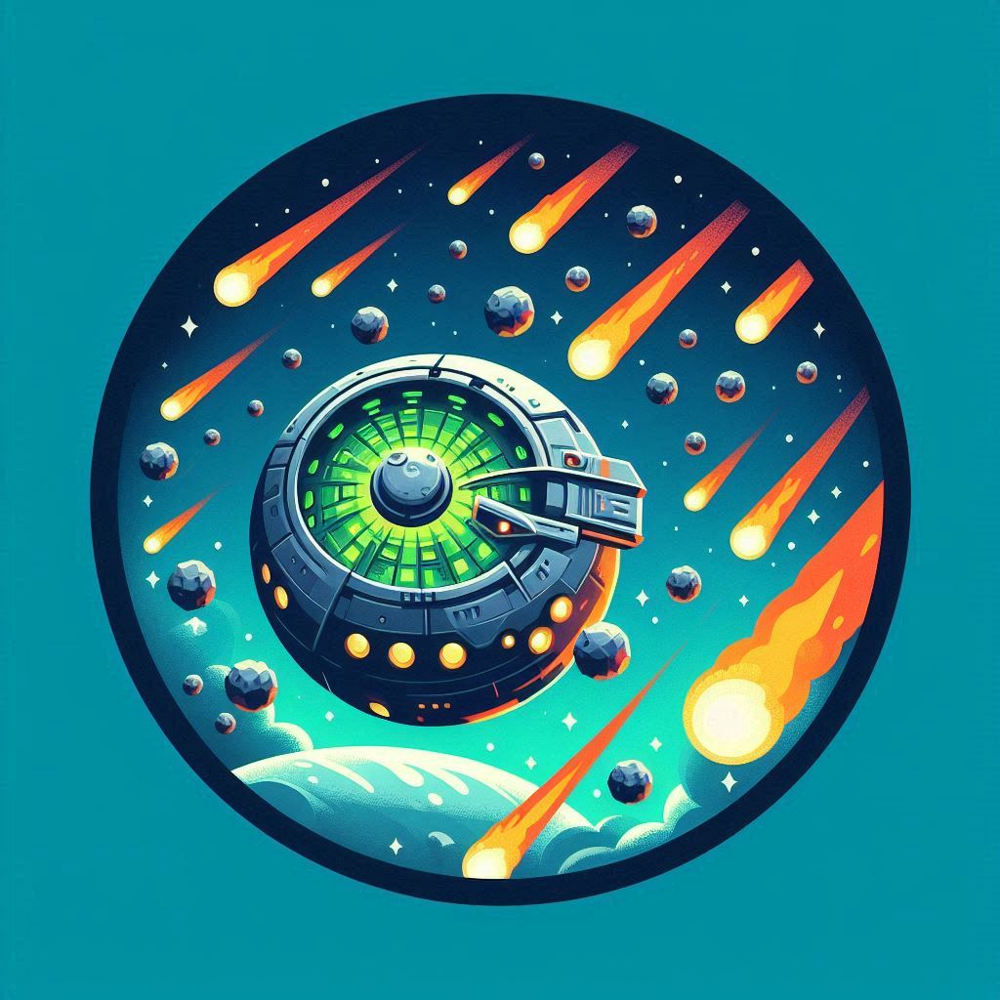

  

<h1 align="center">Βρέχει μπάλες!! (It's Raining Balls!!)</h1>

This Unity 3D project is an interactive arcade-style game created for a university graphics course. The player controls a flying craft and must avoid fireballs falling from the sky.

## Game Overview

- The player controls a spaceship flying above a textured ground.
- Fireballs fall vertically due to gravity from randomized positions.
- The player must avoid collision with the fireballs.
- Collisions trigger explosions using Unity's particle system.

## Controls

### Spaceship Movement
- `A` / `D`: Move left/right (X-axis)
- `S` / `X`: Move backward/forward (Z-axis)
- `W` / `E`: Move up/down (Y-axis)

### Fireball Creation
- `Spacebar`: Spawn a fireball at a random position above the ground

### Camera Controls
- Arrow Keys: Move camera in X/Z plane
- `+` / `-`: Move camera up/down (Y-axis)
- `R ` / `P`: Rotate camera around X axis
- `F` / `L`: Rotate camera around Z axis

## Special Features

- Randomized size and position for each fireball
- Particle effect-based explosions on impact
- Collision logic for ground and spaceship
- Custom model loading (`spheroid.obj`) and terrain textures

## Requirements

- Unity3D (2022.x recommended)
- System capable of running Unity 3D applications

## Bonus Features

- Speed control for the ship (5 levels)
- "Game Over" screen on collision

## Design details
-The readme.pdf contains the details of creating and designing the application.

## Authors

- Themistokleia Siakavara
---
